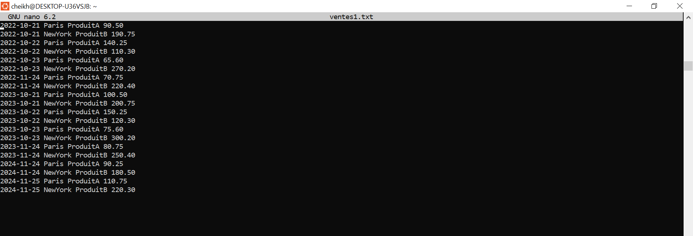
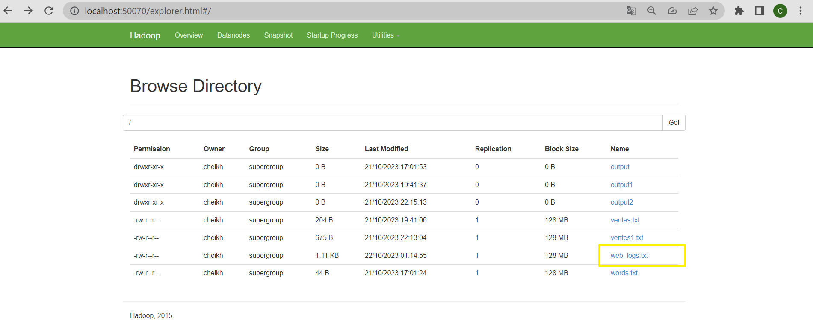
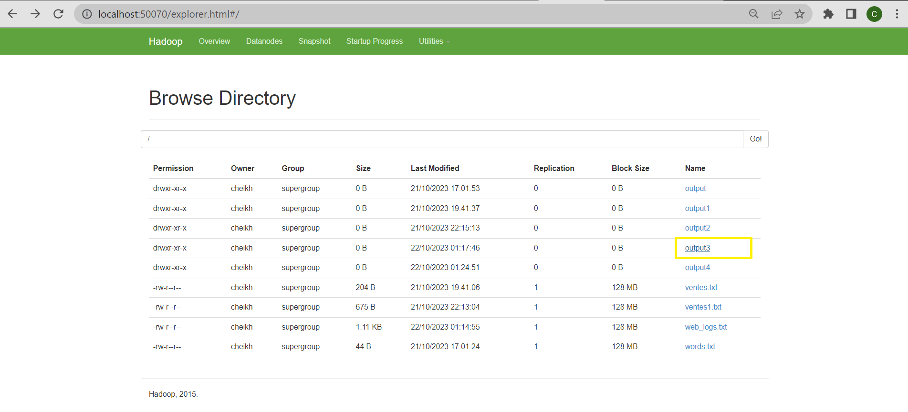
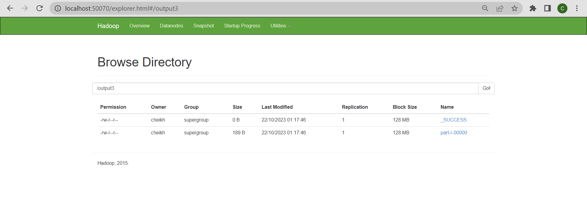
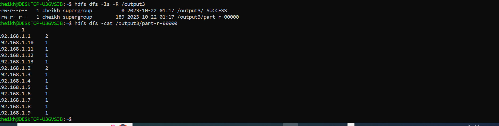
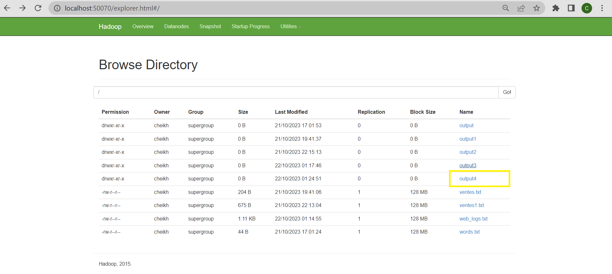
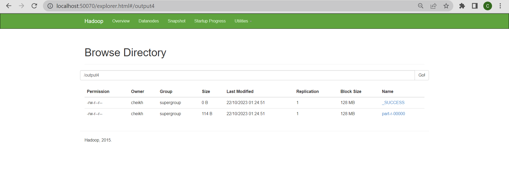
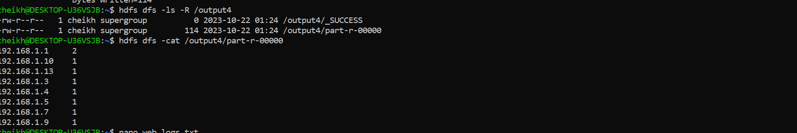

  
<h1>compte rendu</h1>
<h1>Beidja Cheikh</h1>
<h1>Master SDIA2</h1> 
<h1>Exercice 2 :</h1>
<h2>InputFile Ventes.txt</h2> 
  
  
<h1>Partie:1 Total des Requêtes par Adresse IP :</h1>
<h2>output3 in hadoop-HDFS</h2>  
  
  
<h2>output3</h2>  
  
<h1>Partie:2 Requêtes Réussies (Code de Réponse HTTP 200) par Adresse IP :</h1>
<h2>output4 in hadoop-HDFS</h2>  
  
  
<h2>output3</h2>  
  

